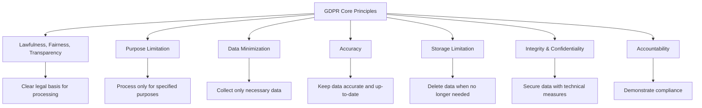

# GDPR Data Protection: Implementation Guide for Developers

After implementing GDPR compliance across multiple SaaS platforms serving EU customers, I've learned that the regulation is more than legal checkboxes—it's about building user trust through transparent data practices and robust technical safeguards.

This guide focuses on practical implementation strategies that go beyond basic consent forms to create genuinely privacy-respecting systems.

## What We're Building

I'll walk you through implementing GDPR's core technical and organizational requirements with architectural patterns that balance compliance with user experience.

**What you'll learn:**
- **Data Mapping & Classification**: Understanding what personal data you process
- **Privacy by Design**: Building data protection into system architecture
- **Consent Management**: Technical implementation of lawful basis
- **Data Subject Rights**: Automated systems for access, portability, and deletion
- **Breach Detection**: Monitoring and notification systems

**Technical approach:**
- Database design patterns for privacy compliance
- API architectures for data subject rights
- Automated compliance monitoring
- Cross-border data transfer controls

## Understanding GDPR Fundamentals

GDPR applies to any organization processing personal data of EU residents, regardless of where the organization is located. The regulation is built on seven key principles:



## Data Mapping and Classification

Before implementing technical controls, you must understand what personal data you process and why.

### Personal Data Inventory

**Data Classification Framework:**
```
Personal Data Categories:
BASIC_IDENTIFIERS:
  - Name, email, phone number, postal address
  - IP addresses, device identifiers, cookies
  - Account usernames, customer IDs
  
SENSITIVE_PERSONAL_DATA (Article 9):
  - Health data, biometric data, genetic data
  - Political opinions, religious beliefs
  - Trade union membership, sexual orientation
  - Criminal convictions and offenses
  
DERIVED_DATA:
  - User behavior patterns, preferences
  - Location data, transaction history
  - Communication metadata, analytics data

Data Processing Purposes:
SERVICE_DELIVERY:
  - Account creation and management
  - Order processing and fulfillment
  - Customer support and communication
  
BUSINESS_OPERATIONS:
  - Analytics and performance monitoring
  - Marketing and promotional activities
  - Security and fraud prevention
  
LEGAL_COMPLIANCE:
  - Tax reporting, regulatory requirements
  - Legal dispute resolution
  - Data breach investigations
```

### Data Flow Mapping

**System Architecture for Data Tracking:**
```
Data Flow Documentation:
Collection Points:
  - Web forms (registration, contact, checkout)
  - API endpoints (mobile apps, integrations)  
  - Third-party sources (social login, data brokers)
  - Cookies and tracking technologies

Processing Systems:
  - Application databases (primary storage)
  - Analytics platforms (behavioral data)
  - Marketing automation (campaign data)
  - Payment processors (transaction data)
  - Log aggregation (system monitoring)

Data Recipients:
  - Internal teams (development, support, marketing)
  - Service providers (hosting, email, analytics)
  - Business partners (affiliates, integrators)
  - Authorities (law enforcement, regulators)

Cross-Border Transfers:
  - Document all transfers outside EU/EEA
  - Implement appropriate safeguards (SCCs, adequacy decisions)
  - Maintain transfer impact assessments
```

## Privacy by Design Architecture

GDPR requires implementing privacy protections from the system design phase, not as an afterthought.

### Database Design Patterns

**Privacy-First Data Schema:**
```
User Data Separation:
Core User Entity:
  - user_id (UUID, primary identifier)
  - created_at, updated_at (lifecycle tracking)
  - legal_basis (consent, contract, legitimate_interest)
  - consent_timestamp, consent_version

Personal Identifiers (Separate Table):
  - user_id (foreign key)
  - email (encrypted, searchable hash index)
  - phone (encrypted when not required for service)
  - name_first, name_last (encrypted)
  - date_of_birth (only if legally required)

Sensitive Data (Separate Database/Schema):
  - user_id (foreign key)
  - health_data (if applicable, extra encryption)
  - political_preferences (Article 9 protections)
  - biometric_data (if applicable)

Behavioral Data (Time-Limited):
  - user_id (foreign key)
  - activity_type, timestamp
  - retention_until (automated deletion)
  - anonymization_eligible (boolean flag)
```

**Data Retention Management:**
```
Automated Retention Policies:
Data Category → Retention Period → Action
MARKETING_CONSENT → 2 years inactive → Delete
TRANSACTION_DATA → 7 years → Archive then delete  
SUPPORT_TICKETS → 3 years → Anonymize
ANALYTICS_DATA → 26 months → Aggregate then delete
SECURITY_LOGS → 1 year → Delete (unless incident)

Implementation Pattern:
1. Tag all data with retention metadata
2. Daily cleanup jobs check retention_until dates
3. Progressive data degradation (anonymize → pseudonymize → delete)
4. Audit trail for all retention actions
5. Legal hold capability for litigation
```

### Encryption and Pseudonymization

**Data Protection Implementation:**
```
Encryption Strategy:
Data at Rest:
  - Database-level encryption for all personal data tables
  - Application-level field encryption for sensitive data
  - Separate encryption keys per data sensitivity level
  - Regular key rotation (90-day cycle)

Data in Transit:
  - TLS 1.3 minimum for all communications
  - End-to-end encryption for sensitive API calls
  - Certificate pinning for mobile applications
  - VPN requirements for admin access

Pseudonymization Approach:
Original Data → Pseudonymization → Storage
email@example.com → hash_12abc34def → user_hash_12abc34def
- Reversible only with separate key material
- Enable analytics without exposing personal data
- Support data subject rights through reverse mapping
- Regular pseudonymization key rotation
```

## Lawful Basis and Consent Management

GDPR requires a lawful basis for all personal data processing. Consent is just one of six possible bases.

### Lawful Basis Framework

**Legal Basis Selection:**
```
Lawful Basis Decision Tree:
CONSENT (Article 6(1)(a)):
  - Marketing communications
  - Optional features (analytics, personalization)
  - Cookies (non-essential)
  Requirements: Freely given, specific, informed, unambiguous

CONTRACT (Article 6(1)(b)):
  - Account creation and management
  - Order processing and delivery
  - Payment processing
  No consent required, but clear communication needed

LEGITIMATE_INTEREST (Article 6(1)(f)):
  - Security monitoring and fraud prevention
  - Direct marketing to existing customers
  - Website functionality improvements
  Requires balancing test and opt-out mechanism

LEGAL_OBLIGATION (Article 6(1)(c)):
  - Tax record keeping
  - Anti-money laundering compliance
  - Data breach notifications
  No user choice, but transparency required
```

### Technical Consent Implementation

**Consent Management System:**
```
Consent Record Structure:
{
  user_id: "uuid-string",
  consent_id: "uuid-string", 
  purpose: "marketing_communications",
  legal_basis: "consent",
  granted: true,
  timestamp: "2025-09-13T10:30:00Z",
  ip_address: "192.168.1.1",
  user_agent: "Mozilla/5.0...",
  consent_method: "explicit_checkbox",
  withdrawal_method: null,
  privacy_policy_version: "v2.1",
  consent_string: "I agree to receive marketing emails"
}

Consent Validation Rules:
- Pre-checked boxes → Invalid
- Bundled consent → Invalid  
- Forced consent for basic service → Invalid
- Unclear language → Invalid
- No easy withdrawal → Invalid

Consent Withdrawal Process:
1. Provide easy withdrawal mechanism (unsubscribe, settings page)
2. Process withdrawal within 24 hours
3. Confirm withdrawal to user
4. Stop processing immediately
5. Log withdrawal event for audit
6. Notify downstream systems
```

## Data Subject Rights Implementation

GDPR grants individuals eight rights over their personal data. Technical systems must support these rights efficiently.

### Right of Access (Article 15)

**Data Export Architecture:**
```
Personal Data Export System:
Data Aggregation Pipeline:
1. Query all systems containing user data
2. Collect data from primary database
3. Gather data from analytics platforms
4. Retrieve data from backup systems
5. Include data from third-party processors

Export Format Structure:
{
  "request_id": "uuid-string",
  "user_id": "uuid-string", 
  "export_date": "2025-09-13T10:30:00Z",
  "data_categories": {
    "personal_identifiers": {
      "email": "user@example.com",
      "name": "John Doe",
      "collection_date": "2024-01-15T09:00:00Z",
      "legal_basis": "contract"
    },
    "behavioral_data": [
      {
        "activity": "page_view",
        "timestamp": "2025-09-12T14:22:00Z",
        "data": {"page": "/products", "duration": 45}
      }
    ],
    "third_party_data": {
      "analytics_provider": "Aggregated behavioral data",
      "email_provider": "Email engagement metrics"
    }
  },
  "retention_periods": {
    "marketing_data": "2 years from last interaction",
    "transaction_data": "7 years from purchase"
  }
}

Response Time Requirements:
- Acknowledge request within 72 hours
- Provide data within 30 days (extendable to 60 days)
- No charge for reasonable requests
- Additional copies may incur admin fee
```

### Right to Rectification (Article 16)

**Data Correction System:**
```
Data Update Workflow:
User Request → Verification → Update → Propagation → Confirmation

Verification Methods:
- Account authentication (for account holders)
- Identity verification (for non-account corrections)
- Supporting documentation (for complex corrections)
- Cross-reference with authoritative sources

Update Propagation:
1. Update primary database immediately
2. Notify all downstream systems
3. Update backups and archives
4. Correct data in analytics platforms
5. Inform third-party processors
6. Update cached data across CDNs

Audit Trail Requirements:
- Log all correction requests
- Document verification process
- Track propagation to all systems
- Record user confirmation
- Maintain correction history
```

### Right to Erasure (Article 17)

**Data Deletion Architecture:**
```
"Right to be Forgotten" Implementation:
Deletion Scope Assessment:
1. Verify deletion grounds (consent withdrawal, objection, etc.)
2. Check for legal retention requirements
3. Assess legitimate interests for retention
4. Determine deletion vs anonymization approach

Technical Deletion Process:
Hard Delete (Complete Removal):
  - Remove from active databases
  - Purge from backup systems
  - Clear from caches and CDNs
  - Delete from log files (where possible)
  - Notify third-party processors

Anonymization (Alternative to Deletion):
  - Remove direct identifiers
  - Apply k-anonymity techniques
  - Ensure no re-identification possible
  - Maintain statistical utility

Deletion Verification:
- Automated verification scripts
- Third-party deletion confirmations
- User notification of completion
- Audit log of deletion process
- Certificate of deletion (if requested)

Legal Retention Overrides:
- Tax records (retain per local law)
- Legal dispute data (litigation hold)
- Regulatory compliance (financial services)
- Security incident data (investigation needs)
```

### Right to Data Portability (Article 20)

**Data Export and Transfer System:**
```
Structured Data Export:
Export Format Options:
- JSON (machine-readable, API-friendly)
- CSV (spreadsheet compatible)
- XML (standardized structure)
- Industry-specific formats (where applicable)

Data Portability Scope:
Included Data:
  - Data provided by user directly
  - Data generated through service use
  - Preference and configuration data
  - User-generated content

Excluded Data:
  - Derived insights and analytics
  - Proprietary algorithms results
  - Third-party enriched data
  - Anonymized aggregated data

Direct Transfer Capability:
API Endpoints:
  - GET /user/export (full data export)
  - POST /user/transfer (direct transfer to another service)
  - Authentication via OAuth 2.0
  - Rate limiting to prevent abuse
  - Encryption for data in transit
```

## Cross-Border Data Transfers

GDPR restricts personal data transfers outside the EU/EEA unless adequate protection is ensured.

### Transfer Mechanism Implementation

**Technical Safeguards:**
```
Data Residency Architecture:
EU Data Processing:
  - Primary databases located in EU/EEA
  - Backup systems within EU boundaries
  - Processing operations in EU data centers
  - EU-based support teams for EU customer data

Cross-Border Transfer Controls:
Standard Contractual Clauses (SCCs):
  - Legal agreements with non-EU processors
  - Technical and organizational measures documentation
  - Regular compliance assessments
  - Transfer impact assessments (TIAs)

Binding Corporate Rules (BCRs):
  - Internal data transfer policies
  - Consistent protection standards globally
  - Independent oversight mechanisms
  - Regular internal audits

Technical Implementation:
Data Classification by Location:
  - EU_RESIDENT: Process only in EU/EEA
  - NON_EU_RESIDENT: Standard processing rules
  - MIXED_DATASET: Apply highest protection standard

Transfer Logging:
  - Log all cross-border data movements
  - Document legal basis for each transfer
  - Monitor compliance with transfer limits
  - Alert on unauthorized transfer attempts
```

## Breach Detection and Notification

GDPR requires notification of personal data breaches within 72 hours to supervisory authorities.

### Automated Breach Detection

**Monitoring and Alerting System:**
```
Breach Detection Triggers:
Access Anomalies:
  - Unusual data access patterns
  - Off-hours database queries
  - Bulk data exports by unauthorized users
  - Failed authentication attempts exceeding thresholds

Technical Incidents:
  - Database security incidents
  - Unauthorized system access
  - Data encryption failures
  - Backup system compromises

Human Error Events:
  - Email sent to wrong recipients
  - Public exposure of private data
  - Incorrect access permission assignments
  - Accidental data deletion

Breach Assessment Automation:
Risk Scoring Algorithm:
  - Data sensitivity level (1-10 scale)
  - Number of affected individuals
  - Likelihood of identification
  - Potential harm to data subjects
  - Technical protection measures in place

Automatic Classification:
HIGH_RISK (Score 8-10):
  - Immediate notification required
  - Data subject notification required
  - Emergency response team activation

MEDIUM_RISK (Score 5-7):
  - 72-hour notification timeline
  - Enhanced monitoring
  - Risk mitigation measures

LOW_RISK (Score 1-4):
  - Internal documentation
  - Process improvement review
  - Monitoring for escalation
```

### Incident Response Workflow

**Breach Notification System:**
```
72-Hour Notification Process:
Hour 0-4 (Detection & Assessment):
  - Automated alert generation
  - Initial risk assessment
  - Incident response team notification
  - Immediate containment measures

Hour 4-24 (Investigation):
  - Detailed breach investigation
  - Scope and impact assessment
  - Root cause analysis
  - Affected data subject identification

Hour 24-48 (Documentation):
  - Formal breach report preparation
  - Risk to data subjects evaluation
  - Mitigation measures documentation
  - Legal requirement assessment

Hour 48-72 (Notification):
  - Supervisory authority notification
  - Data subject notification (if required)
  - Internal stakeholder briefing
  - Public disclosure (if necessary)

Notification Content Requirements:
Supervisory Authority Report:
  - Nature of breach and affected data types
  - Number and categories of data subjects
  - Likely consequences of the breach
  - Measures taken or proposed to address breach
  - Contact details for further information

Data Subject Notification:
  - Clear and plain language description
  - Specific risks to the individual
  - Recommended protective measures
  - Contact information for questions
  - Right to complain to supervisory authority
```

## Compliance Monitoring and Auditing

GDPR requires ongoing demonstration of compliance through documentation and regular assessments.

### Automated Compliance Tracking

**Compliance Dashboard System:**
```
Daily Compliance Metrics:
Data Processing Compliance:
  - Consent withdrawal processing time
  - Data subject request response rate
  - Cross-border transfer monitoring
  - Data retention policy adherence
  - Encryption status verification

Privacy Rights Fulfillment:
  - Access requests (average response time)
  - Rectification requests (completion rate)
  - Erasure requests (verification percentage)
  - Portability requests (format compliance)
  - Objection requests (processing halt time)

Technical Safeguards Status:
  - Encryption key rotation schedule
  - Database access logging coverage
  - Backup system compliance
  - Third-party processor assessments
  - Security incident response times

Regulatory Reporting:
Monthly Compliance Report:
  - Data subject rights request summary
  - Cross-border transfer activity
  - Consent management statistics
  - Security incident summary
  - Third-party processor compliance status

Annual Privacy Impact Assessment:
  - Processing activity inventory update
  - Risk assessment refresh
  - Control effectiveness evaluation
  - Regulatory change impact analysis
  - Compliance program improvement plan
```

## Implementation Roadmap

**Phase 1: Foundation (Weeks 1-6)**
- Complete data mapping and classification
- Implement basic consent management
- Set up data retention policies
- Establish breach detection monitoring

**Phase 2: Rights Implementation (Weeks 7-12)**
- Build data subject rights API endpoints
- Implement automated data export
- Create data correction workflows
- Develop deletion and anonymization processes

**Phase 3: Advanced Compliance (Weeks 13-18)**
- Deploy cross-border transfer controls
- Enhance breach notification systems
- Implement compliance monitoring dashboard
- Conduct privacy impact assessments

## Common Implementation Challenges

**Technical Challenges:**
1. **Data Fragmentation**: Personal data scattered across multiple systems
2. **Legacy System Integration**: Older systems not designed for privacy rights
3. **Real-time Processing**: Balancing performance with privacy requirements
4. **Cross-System Consistency**: Ensuring data updates propagate everywhere

**Organizational Challenges:**
1. **Process Integration**: Embedding privacy into existing workflows
2. **Team Training**: Ensuring all staff understand GDPR requirements
3. **Vendor Management**: Ensuring third parties meet compliance standards
4. **Cost Management**: Balancing compliance costs with business needs

## Conclusion

GDPR compliance is not just about avoiding fines—it's about building trust with users through transparent, respectful data practices. The technical implementations I've outlined provide a foundation for genuine privacy protection while maintaining business functionality.

The key is starting with strong architectural foundations: proper data classification, privacy-by-design principles, and automated compliance monitoring. Build these systems incrementally, test thoroughly, and document everything.

Remember that GDPR is a living regulation—privacy practices must evolve with changing technology, business needs, and regulatory guidance. Treat compliance as an ongoing commitment to user privacy, not a one-time technical implementation.