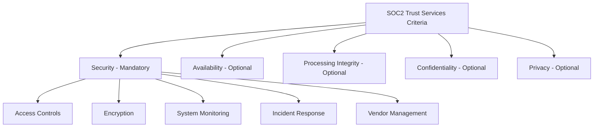
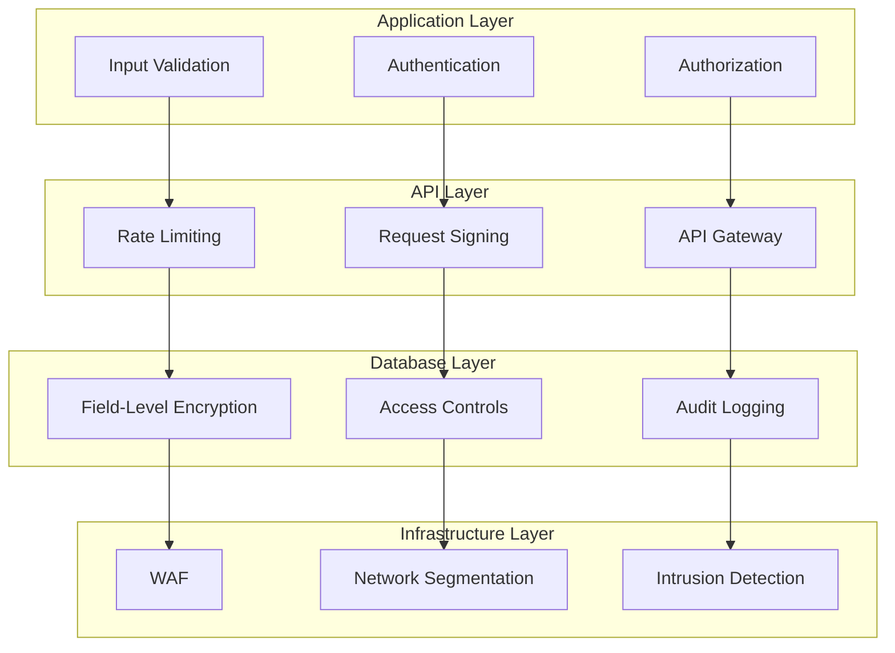

# SOC2 Security Controls: A Developer's Guide to Implementation

When I first encountered SOC2 compliance requirements while architecting a SaaS platform, I was overwhelmed by the abstract nature of the framework. Unlike prescriptive standards like PCI DSS, SOC2 provides flexibility—but that flexibility can be paralyzing when you're trying to build actual systems.

This guide breaks down SOC2 security controls into actionable technical implementations with architectural patterns I've used in production environments.

## What We're Building

I'll walk you through implementing the five core SOC2 Trust Services Criteria with a focus on the **Security** principle, which forms the foundation for all other controls.

**What you'll learn:**
- **Access Control Systems**: Role-based access with audit trails
- **Encryption Architecture**: Data-at-rest and in-transit protection
- **Monitoring & Logging**: Real-time security event detection
- **Incident Response**: Automated breach detection and notification

**Technical approach:**
- Language-agnostic architectural patterns
- Infrastructure security configurations
- Process flows and decision trees
- Compliance monitoring strategies

The end result is a security-first architecture that not only meets SOC2 requirements but provides genuine protection against modern threats.

## Understanding the SOC2 Framework

SOC2 is built around five Trust Services Criteria, with **Security** being mandatory for all organizations:



Unlike compliance checkboxes, SOC2 requires demonstrating **operational effectiveness** over time. A Type II audit examines your controls for 3-12 months, not just their design at a point in time.

## Core Principle: Defense in Depth

SOC2 security is built on **defense in depth**—multiple layers of security controls that protect against different attack vectors.



Each layer provides independent protection, so a breach at one level doesn't compromise the entire system.

## CC6: Logical and Physical Access Controls

This is the heart of SOC2 security. You must restrict access to systems and data to authorized users only, with proper authentication and authorization mechanisms.

### Role-Based Access Control (RBAC)

Here's the architectural approach for a comprehensive RBAC system with audit trails:

**User Management System:**
```
User Entity:
  - Unique identifier (UUID)
  - Email (unique, required)
  - Password hash (bcrypt with salt rounds ≥ 12)
  - MFA secret (TOTP-based)
  - Account status (active/suspended/deactivated)
  - Last login timestamp
  - Password change history

Role Association:
  - Many-to-many relationship between Users and Roles
  - Junction table tracks assignment date and authorized by
  - Support for time-bound role assignments
```

**Role Definition System:**
```
Role Entity:
  - Unique role identifier
  - Human-readable role name
  - Description and purpose
  - Permission array (granular permissions)
  - Inheritance hierarchy (optional)

SOC2 Predefined Roles:
  SYSTEM_ADMIN:
    - Permissions: [user:*, system:admin, audit:read]
    - Access level: Full system access
    
  DATA_PROCESSOR:
    - Permissions: [data:read, data:process]
    - Access level: Limited to data operations
    
  COMPLIANCE_AUDITOR:
    - Permissions: [audit:*, reports:generate]
    - Access level: Read-only audit access
    
  CUSTOMER_SUPPORT:
    - Permissions: [customer:read, ticket:write]
    - Access level: Customer service operations
```

### Multi-Factor Authentication (MFA)

SOC2 requires strong authentication mechanisms beyond passwords:

**MFA Implementation Architecture:**
```
MFA Setup Process:
1. Generate TOTP secret using cryptographically secure random generator
2. Create QR code for mobile authenticator app registration
3. Encrypt and store secret using application encryption key
4. Require backup codes generation (8-10 single-use codes)
5. Log MFA enrollment event to audit trail

MFA Verification Process:
1. User provides username + password (first factor)
2. System prompts for TOTP code (second factor)
3. Decrypt stored MFA secret
4. Validate TOTP token with 30-second time window
5. Allow 1-window variance for clock drift tolerance
6. Log authentication attempt (success/failure)
7. Rate limit failed MFA attempts (5 failures = temporary lockout)

Security Considerations:
- Encrypt MFA secrets using AES-256 with application key
- Store secrets separate from user credentials
- Implement progressive delays: 1s, 2s, 4s, 8s, 16s between attempts
- Account lockout after 5 consecutive failures
```

### Authorization Framework

Implement granular permission checking throughout your application:

**Permission-Based Access Control:**
```
Authorization Flow:
1. Extract user token from request header
2. Validate token signature and expiration
3. Retrieve user profile with associated roles
4. Aggregate all permissions from user's roles
5. Check required permissions against user permissions
6. Log authorization attempt (granted/denied)
7. Either continue request or return 403 Forbidden

Permission Structure:
- Format: "resource:action" (e.g., "user:read", "data:write")
- Wildcard support: "user:*" grants all user operations
- Hierarchical permissions: "admin:*" implies all admin functions
- Context-aware: "customer:read:own" vs "customer:read:all"

Audit Logging Strategy:
- Event ID (UUID for correlation)
- Timestamp (ISO 8601 with timezone)
- User ID, Action, Resource, Result
- IP Address and User Agent
- Session ID for correlation
- Log all denied access attempts with required vs actual permissions
```

## CC7: System Operations and Availability

This control ensures your systems operate as intended and remain available for processing.

### Real-Time Security Monitoring

**Monitoring Architecture:**
```
Security Event Collection:
- Application logs (authentication, authorization, errors)
- Database access logs (queries, connections, failures)  
- Infrastructure logs (network traffic, system resources)
- User behavior analytics (login patterns, data access)

Event Processing Pipeline:
1. Log Ingestion → Central logging system (ELK stack)
2. Event Parsing → Structured data extraction  
3. Pattern Detection → ML-based anomaly detection
4. Threshold Monitoring → Rule-based alerting
5. Alert Generation → Severity-based notifications
6. Response Automation → Immediate containment actions

Monitoring Thresholds:
Failed Logins:
  - 5 failures in 5 minutes → Warning alert
  - 10 failures in 5 minutes → Lock account + Security alert
  - 50 failures across all users → Potential attack investigation

API Request Patterns:
  - 1000 requests/minute per user → Rate limiting
  - 10,000 requests/minute total → DDoS investigation
  - Unusual geographic patterns → Fraud alert

Data Access Monitoring:
  - 100+ customer records accessed → Supervisor notification
  - After-hours sensitive data access → Security review
  - Bulk data exports → Automated approval workflow
```

### Database Activity Monitoring

SOC2 requires comprehensive monitoring of access to sensitive data:

**Database Monitoring Strategy:**
```
Access Tracking Requirements:
- WHO: User ID, role, session information
- WHAT: Tables accessed, operations performed, data modified
- WHEN: Timestamp with timezone, duration of operation
- WHERE: Source IP, geographic location, device info
- WHY: Business context, request correlation ID

Sensitive Data Classification:
PUBLIC → No special monitoring required
INTERNAL → Basic access logging only
CONFIDENTIAL → Enhanced monitoring + approval workflows
RESTRICTED → Field-level encryption + real-time alerts

Monitoring Rules by Classification:
- CONFIDENTIAL: Alert on >50 records accessed per session
- RESTRICTED: Alert on ANY access + require secondary approval
- Cross-classification: Alert on unusual data combination access
```

## Data Encryption Architecture

SOC2 strongly recommends encryption for protecting sensitive data:

### Field-Level Database Encryption

**Encryption Implementation:**
```
Encryption Service Architecture:
Algorithm: AES-256-GCM (industry standard)
Key Management: 
  - Separate encryption keys from data storage
  - 90-day key rotation schedule
  - Hardware Security Module (HSM) for key storage
  - Version tracking for key rotation

Data Structure:
Encrypted Field = {
  encrypted_data: "base64_encoded_ciphertext",
  initialization_vector: "random_16_bytes",
  authentication_tag: "gcm_auth_tag",
  key_version: "current_key_identifier"
}

Implementation Pattern:
1. Application-level encryption before database storage
2. Decryption only when data actually needs to be used
3. Cache decrypted data minimally (session-only)
4. Log all encryption/decryption operations
5. Separate "display" fields (first 6, last 4 digits of card)
```

### Infrastructure Security Configuration

**AWS Security Configuration:**
```yaml
# Terraform configuration for SOC2-compliant infrastructure
Security Groups:
  Application Tier:
    - Ingress: HTTPS (443) only from load balancer
    - Egress: Database and external APIs only
    
  Database Tier:
    - Ingress: Application tier only (port 5432/3306)
    - No direct internet access
    
  Bastion Host:
    - SSH access from specific IP ranges
    - Multi-factor authentication required
    - Session recording enabled

RDS Configuration:
  - Storage encryption: Enabled (AES-256)
  - Backup encryption: Enabled
  - Backup retention: 30 days minimum
  - Multi-AZ deployment: Production environments
  - VPC security groups: Database tier only
  - Enhanced monitoring: Enabled
  
CloudTrail Audit Logging:
  - Multi-region trail: Enabled
  - Log file encryption: KMS managed
  - Log file integrity validation: Enabled
  - S3 bucket: Access logging enabled
```

## CC8: Change Management

All system changes must be authorized, tested, and documented:

### Secure Deployment Pipeline

**CI/CD Security Gates:**
```
Pre-Deployment Security Checks:
1. SAST (Static Application Security Testing)
2. Dependency vulnerability scanning  
3. Secret detection (API keys, passwords)
4. Infrastructure as Code security scanning
5. Peer code review (minimum 2 approvals)
6. Security team review for high-risk changes

Deployment Process:
- Blue-green deployment strategy
- Automated rollback triggers
- Health checks and monitoring validation
- Post-deployment security verification

Change Documentation:
- Change request ID and approval trail
- Deployment artifacts and checksums
- Security impact assessment
- Rollback plan and success criteria
```

## Incident Response Framework

SOC2 requires documented incident response procedures:

**Incident Response Architecture:**
```
Incident Classification:
CRITICAL (15 min response): Data breach, system compromise
HIGH (1 hour): Unauthorized access, service disruption
MEDIUM (4 hours): Security policy violations
LOW (24 hours): Minor configuration issues

Response Workflow:
1. Detection → Automated monitoring or manual report
2. Classification → Severity assessment and assignment
3. Containment → Immediate threat mitigation
4. Investigation → Root cause analysis
5. Recovery → Service restoration
6. Documentation → Lessons learned and control updates

Automated Response Actions:
- Account suspension for suspicious login patterns
- IP blocking for repeated failed attempts
- Session termination for privilege escalation
- Alert generation for security team
- Compliance notification for data breaches (72-hour rule)
```

## Continuous Compliance Monitoring

SOC2 isn't a one-time certification—it requires ongoing monitoring:

**Daily Compliance Checks:**
```
Automated Monitoring:
- User access reviews (90-day maximum)
- Failed login attempt patterns
- Encryption status verification
- Backup completion status
- Security alert resolution times
- Vendor security assessment currency

Monthly Reports:
- Access control effectiveness
- Security incident summary
- Change management statistics
- Third-party risk assessments
- Control testing results

Quarterly Reviews:
- Role and permission audits
- Security policy updates
- Incident response procedure testing
- Vendor security reassessments
- Control design effectiveness review
```

## Implementation Roadmap

**Phase 1: Foundation (Weeks 1-4)**
- Set up basic authentication and authorization
- Implement audit logging for all sensitive operations
- Configure database encryption
- Establish monitoring and alerting

**Phase 2: Hardening (Weeks 5-8)**
- Add multi-factor authentication
- Implement role-based access controls
- Set up automated security testing
- Create incident response procedures

**Phase 3: Compliance (Weeks 9-12)**
- Conduct internal security assessments
- Generate compliance reports
- Document all controls and procedures
- Prepare for SOC2 audit

## Common Implementation Pitfalls

After implementing SOC2 controls across multiple organizations, I've seen these recurring issues:

1. **Over-engineering**: Don't build complex systems if simpler ones meet requirements
2. **Documentation gaps**: SOC2 auditors need to see evidence of control operation
3. **Testing neglect**: Controls must be tested regularly to ensure effectiveness
4. **Access creep**: Regular access reviews are critical for maintaining least privilege
5. **Logging gaps**: Missing audit trails for sensitive operations are audit findings

## Conclusion

SOC2 compliance is a journey that requires balancing security with usability while maintaining comprehensive documentation. The investment in proper security architecture pays dividends beyond compliance—it creates customer trust and protects your business from increasingly sophisticated threats.

The key is treating SOC2 not as a checkbox exercise, but as an opportunity to build robust, secure systems that protect both your organization and your customers' data. Start with the Security principle, build strong foundations, and expand systematically to other Trust Services Criteria as your program matures.